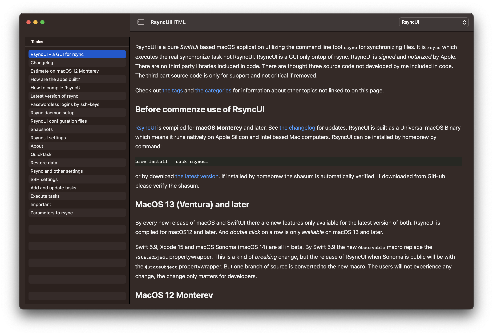

The application read the RSS feeds of documentation for [RsyncUI](https://rsyncui.netlify.app/) and  [RsyncOSX](https://rsyncosx.netlify.app/). The documentation is built by Hugo and served on Netlify as static web pages. The application utilizes two external libraries:

- [RichText](https://github.com/NuPlay/RichText)
- [FeedKit](https://github.com/nmdias/FeedKit)

FeedKit reads the RSS feeds, RichText displays the feeds as HTML. The application is developed by SwiftUI and the source is a few lines of code. The real work is by the two external libraries.

RsyncUIHTML is built for macOS 13 and later.

